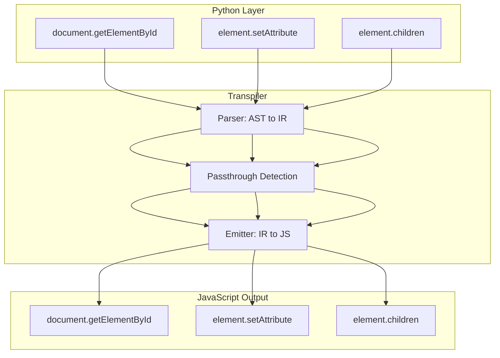

# Phase 34.1: Core DOM APIs Implementation

## Overview

Implement Document and Element APIs that let Python developers manipulate the DOM with a clean, Pythonic interface. The transpiled JavaScript will be hyperoptimized — no runtime wrappers, just direct DOM calls.

## Architecture




## Key Design Decision: Zero-Runtime Passthrough

Unlike stdlib modules that need runtime helpers, DOM APIs are **passthrough** — the Python syntax maps 1:1 to JavaScript:| Python | JavaScript | Transformation |

|--------|------------|----------------|

| `document.getElementById("app")` | `document.getElementById("app")` | None (passthrough) |

| `el.setAttribute("id", "123")` | `el.setAttribute("id", "123")` | None (passthrough) |

| `el.dataset.userId` | `el.dataset.userId` | None (passthrough) |

| `el.children` | `el.children` | None (passthrough) |This means **zero runtime overhead** — DOM code transpiles to the exact same JavaScript a web developer would write.

## Files to Create/Modify

### Python Stubs (Type Hints + Documentation)

| File | Purpose |

|------|---------|

| [`pynext/client/dom.py`](pynext/client/dom.py) | Document and Element Python stubs with full type hints |

| [`pynext/client/node.py`](pynext/client/node.py) | Node, NodeList, HTMLCollection types |

| [`pynext/client/__init__.py`](pynext/client/__init__.py) | Export document, Element, Node |

### Transpiler Modifications

| File | Purpose |

|------|---------|

| [`pynext/transpiler/imports.py`](pynext/transpiler/imports.py) | Handle `from pynext.client import document` |

| [`pynext/transpiler/dom.py`](pynext/transpiler/dom.py) | NEW: DOM-specific emission helpers |

| [`pynext/transpiler/emitter.py`](pynext/transpiler/emitter.py) | Integrate DOM passthrough detection |

### Tests (100 tests total)

| File | Tests | Coverage |

|------|-------|----------|

| `tests/unit/client/test_341_document.py` | 30 | Document queries, creation, state |

| `tests/unit/client/test_341_element.py` | 35 | Attributes, content, properties |

| `tests/unit/client/test_341_traversal.py` | 20 | DOM tree navigation |

| `tests/unit/client/test_341_manipulation.py` | 15 | appendChild, remove, etc. |

| `tests/integration/transpiler/test_341_dom_parity.py` | 15 | Mini-app harness tests |

### Documentation

| File | Purpose |

|------|---------|

| `docs/features/DOM_API.md` | Complete API reference with examples |

| `docs/test-case-tracking/phase-34/phase-34-1/TEST_OVERVIEW.md` | Test documentation |

## Implementation Strategy

### Step 1: Python Stubs with Rich Type Hints

Create Python classes that provide:

- Full IDE autocompletion
- Type checking during development
- Documentation strings (who/what/when/where/why/how)
- No runtime logic (pure type stubs)
```python
# pynext/client/dom.py
class Element:
    """
    WHO: Web developers manipulating DOM elements
    WHAT: Represents an HTML/SVG element in the document
    WHEN: Use when you need to modify element attributes, content, or structure
    WHERE: Client-side code (transpiled to JavaScript)
    WHY: Provides Pythonic DOM manipulation
    HOW: Passthrough to JavaScript - same API, zero runtime cost
    """
    
    id: str
    tagName: str
    className: str
    innerHTML: str
    innerText: str
    textContent: str
    
    def getAttribute(self, name: str) -> Optional[str]: ...
    def setAttribute(self, name: str, value: str) -> None: ...
    def removeAttribute(self, name: str) -> None: ...
    # ... etc
```


### Step 2: Transpiler Import Handling

Modify [`pynext/transpiler/imports.py`](pynext/transpiler/imports.py) to recognize DOM imports:

```python
# In parse_import_from()
DOM_PASSTHROUGH_IMPORTS = {
    "document": None,  # Global, no import needed
    "Element": None,   # Type only, no import needed
    "Node": None,      # Type only, no import needed
}

if node.module == "pynext.client":
    for alias in node.names:
        if alias.name in DOM_PASSTHROUGH_IMPORTS:
            # Don't emit an import - these are browser globals
            # Just register that the name is valid
            pass
```


### Step 3: Emitter Passthrough Logic

The key insight: DOM calls need **zero transformation**. Create a passthrough detector in [`pynext/transpiler/dom.py`](pynext/transpiler/dom.py):

```python
# DOM methods that pass through unchanged
DOM_PASSTHROUGH_METHODS = {
    # Document queries
    "getElementById", "querySelector", "querySelectorAll",
    "getElementsByClassName", "getElementsByTagName", "getElementsByName",
    
    # Element creation
    "createElement", "createElementNS", "createTextNode",
    "createComment", "createDocumentFragment",
    
    # Attributes
    "getAttribute", "setAttribute", "removeAttribute",
    "hasAttribute", "toggleAttribute",
    
    # ... all 50+ DOM methods
}

def is_dom_passthrough(node: Attribute) -> bool:
    """Check if this attribute access should pass through unchanged."""
    # document.getElementById -> passthrough
    # element.setAttribute -> passthrough
    # custom_obj.method -> NOT passthrough
    return node.attr in DOM_PASSTHROUGH_METHODS
```


### Step 4: Comprehensive Test Suite

Create 100 tests organized by category:

```javascript
test_341_document.py (30 tests)
├── test_get_element_by_id_basic
├── test_get_element_by_id_not_found_returns_null
├── test_query_selector_class
├── test_query_selector_id
├── test_query_selector_complex_selector
├── test_query_selector_all_returns_nodelist
├── test_create_element_div
├── test_create_element_ns_svg
├── test_create_text_node
├── test_create_document_fragment
├── ... (20 more)

test_341_element.py (35 tests)
├── test_get_attribute
├── test_set_attribute
├── test_remove_attribute
├── test_has_attribute
├── test_toggle_attribute_on
├── test_toggle_attribute_off
├── test_dataset_read
├── test_dataset_write
├── test_inner_html_read
├── test_inner_html_write
├── test_text_content
├── test_class_name
├── ... (23 more)

test_341_traversal.py (20 tests)
├── test_parent_element
├── test_children
├── test_child_nodes
├── test_first_element_child
├── test_last_element_child
├── test_next_element_sibling
├── test_previous_element_sibling
├── test_closest
├── test_matches
├── ... (11 more)

test_341_manipulation.py (15 tests)
├── test_append_child
├── test_insert_before
├── test_remove_child
├── test_replace_child
├── test_remove_self
├── test_clone_node_shallow
├── test_clone_node_deep
├── test_append_multiple
├── test_prepend
├── test_before
├── test_after
├── test_replace_with
├── ... (3 more)
```


### Step 5: Mini-Application Integration Tests

Using the existing `MiniAppHarness`:

```python
# tests/integration/transpiler/test_341_dom_parity.py

def test_dom_todo_app():
    """Full todo app using DOM APIs."""
    code = '''
from pynext.client import document

def add_todo(text):
    li = document.createElement("li")
    li.textContent = text
    document.getElementById("todo-list").appendChild(li)

add_todo("Buy groceries")
print(document.getElementById("todo-list").children.length)
    '''
    # Verify transpiled JS is clean passthrough
    js = transpile(code)
    assert "document.createElement" in js
    assert "document.getElementById" in js
    assert "__py." not in js  # No runtime helpers needed!
```


## Transpilation Mechanism Documentation

Create [`docs/internals/TRANSPILATION_DOM.md`](docs/internals/TRANSPILATION_DOM.md):

````markdown
# DOM Transpilation Mechanism

## Why Passthrough?

DOM APIs are identical in Python and JavaScript. Unlike Python's `list.append()` 
(which differs from JS `Array.push()`), DOM methods are standardized:

| Python | JavaScript | Notes |
|--------|------------|-------|
| `el.appendChild(child)` | `el.appendChild(child)` | W3C standard |
| `el.getAttribute("id")` | `el.getAttribute("id")` | W3C standard |

## How It Works

1. **Parser**: Recognizes `document.*` and `element.*` patterns
2. **Scope Tracker**: Marks DOM variables (from type hints)
3. **Emitter**: Passes through unchanged (no `__py.*` wrappers)

## Output Comparison

### Before (Hypothetical Runtime Approach)
```javascript
// BAD: Unnecessary wrapper
__py.dom.getElementById(document, "app")
````


### After (Passthrough Approach)

```javascript
// GOOD: Identical to hand-written JS
document.getElementById("app")
```
```javascript

## AI-Friendly Design Principles

1. **Consistent Naming**: Python names = JavaScript names
2. **No Magic**: What you write is what you get
3. **Full Type Hints**: IDE autocompletion works perfectly
4. **Comprehensive Docstrings**: LLMs can understand intent
5. **Clear Error Messages**: Point to exact line/column
6. **Test Coverage**: Every edge case documented

## Success Criteria

- [ ] All 100 tests pass
- [ ] Zero `__py.*` calls in DOM-only transpiled code
- [ ] Full type hint coverage (mypy passes)
- [ ] Documentation covers who/what/when/where/why/how
- [ ] Mini-app tests verify Python/JS parity

```