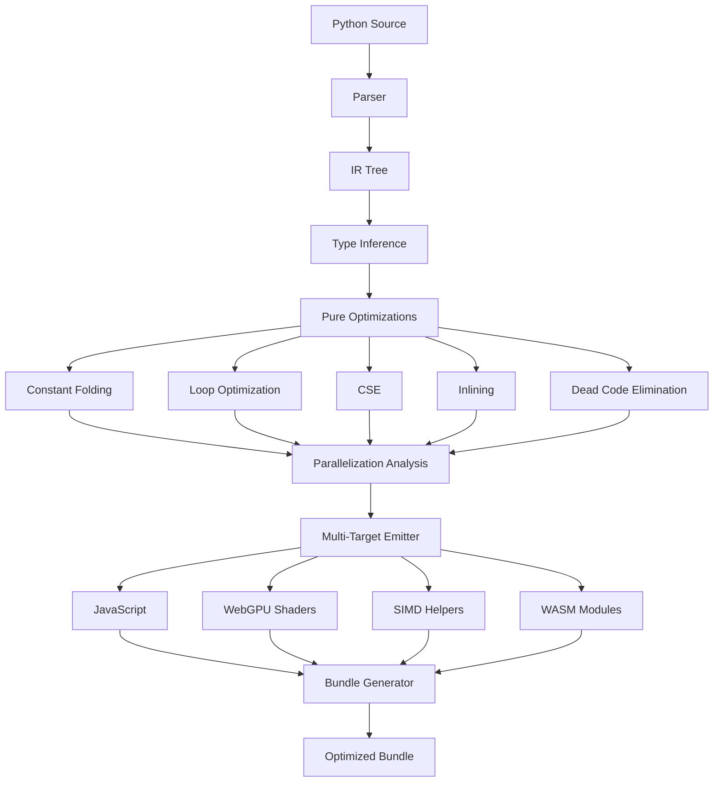

# PyNext Ultra: Pure Static Optimization System

## Overview

PyNext Ultra adds aggressive compile-time optimizations to the PyNext transpiler, achieving 3-10x performance improvements and 30-50% code size reduction through pure static analysis—no runtime data or ML models required.

## Architecture




## Phase Breakdown

### Phase 1: Foundation Optimizations (Quick Wins)

**Goal**: Implement basic optimizations that provide immediate 20-40% improvements with minimal complexity.

#### 1.1 Constant Folding and Propagation

- **File**: `pynext/transpiler/optimizer/constant_folding.py` (NEW)
- **What**: Evaluate constant expressions at compile time
- **Examples**:
- `5 + 3` → `8`
- `"hello" + "world"` → `"helloworld"`
- `len([1, 2, 3]) `→ `3`
- `True and False` → `False`
- **Impact**: 10-30% faster, smaller code
- **Dependencies**: Type inference (existing)

#### 1.2 Enhanced Dead Code Elimination

- **File**: `pynext/transpiler/optimizer/dce.py` (ENHANCE)
- **What**: Expand current DCE to remove:
- Code after return statements
- Unreachable branches (`if False: ...`)
- Unused function parameters
- Dead stores (write then overwrite)
- **Impact**: 30-50% smaller code
- **Dependencies**: Control flow analysis

#### 1.3 Branch Elimination

- **File**: `pynext/transpiler/optimizer/branch_elimination.py` (NEW)
- **What**: Remove branches with constant conditions
- **Examples**:
- `if True: x = 5` → `x = 5`
- `if False: x = 5` → (removed)
- `DEBUG = False; if DEBUG: ...` → (removed)
- **Impact**: Smaller code, faster execution
- **Dependencies**: Constant folding

#### 1.4 Copy Propagation

- **File**: `pynext/transpiler/optimizer/copy_propagation.py` (NEW)
- **What**: Replace variable copies with source values
- **Examples**:
- `x = 5; y = x; z = y + 1` → `x = 5; z = 5 + 1` → `z = 6`
- **Impact**: Better register usage, enables further optimizations
- **Dependencies**: Type inference

### Phase 2: Expression Optimizations (High Impact)

**Goal**: Optimize expressions and eliminate redundant computations.

#### 2.1 Common Subexpression Elimination (CSE)

- **File**: `pynext/transpiler/optimizer/cse.py` (NEW)
- **What**: Eliminate redundant computations
- **Examples**:
- `x = a + b; y = a + b; z = a + b` → `temp = a + b; x = temp; y = temp; z = temp`
- `obj.foo()` called multiple times → hoist to variable
- `arr[i]` accessed multiple times → cache in variable
- **Impact**: 20-40% faster (eliminates redundant work)
- **Dependencies**: Data flow analysis

#### 2.2 Store-to-Load Forwarding

- **File**: `pynext/transpiler/optimizer/store_load.py` (NEW)
- **What**: Forward store values directly to loads
- **Examples**:
- `x = 5; y = x` → `x = 5; y = 5`
- **Impact**: Better register usage
- **Dependencies**: Copy propagation

#### 2.3 Dead Store Elimination

- **File**: `pynext/transpiler/optimizer/dead_store.py` (NEW)
- **What**: Remove stores that are never read
- **Examples**:
- `x = 5; x = 10; y = x` → `x = 10; y = x`
- `x = compute(); # x never used` → (removed)
- **Impact**: Smaller code, less memory writes
- **Dependencies**: Liveness analysis

### Phase 3: Loop Optimizations (Maximum Impact)

**Goal**: Transform loops for 2-5x performance improvements.

#### 3.1 Loop Invariant Code Motion

- **File**: `pynext/transpiler/optimizer/loop_optimizer.py` (NEW)
- **What**: Hoist loop-invariant code outside loops
- **Examples**:
  ```python
                        # Before:
                        for i in range(n):
                            x = expensive()  # Doesn't depend on i
                            arr[i] = x + i
                        
                        # After:
                        x = expensive()
                        for i in range(n):
                            arr[i] = x + i
  ```


- **Impact**: 2-10x faster loops
- **Dependencies**: Data flow analysis

#### 3.2 Loop Unrolling

- **File**: `pynext/transpiler/optimizer/loop_optimizer.py` (EXTEND)
- **What**: Unroll small loops
- **Examples**:
  ```python
                        # Before:
                        for i in range(3):
                            process(i)
                        
                        # After:
                        process(0)
                        process(1)
                        process(2)
  ```


- **Impact**: Eliminates loop overhead
- **Dependencies**: Constant folding

#### 3.3 Strength Reduction

- **File**: `pynext/transpiler/optimizer/loop_optimizer.py` (EXTEND)
- **What**: Replace expensive operations with cheaper ones
- **Examples**:
- `i * 8` → `i << 3` (if beneficial)
- `i * 2` in loop → accumulate `x += 2`
- **Impact**: Faster arithmetic
- **Dependencies**: Loop analysis

#### 3.4 Loop Fusion

- **File**: `pynext/transpiler/optimizer/loop_optimizer.py` (EXTEND)
- **What**: Combine adjacent loops over same data
- **Examples**:
  ```python
                        # Before:
                        for x in a: process(x)
                        for x in a: process2(x)
                        
                        # After:
                        for x in a: process(x); process2(x)
  ```


- **Impact**: Better cache locality
- **Dependencies**: Loop analysis

### Phase 4: Function Optimizations

**Goal**: Optimize function calls and eliminate overhead.

#### 4.1 Aggressive Function Inlining

- **File**: `pynext/transpiler/optimizer/inlining.py` (ENHANCE existing)
- **What**: Inline small functions more aggressively
- **Criteria**:
- Function size < 10 statements
- Called once or few times
- No recursion
- No complex control flow
- **Impact**: 10-30% faster (eliminates call overhead)
- **Dependencies**: Call graph analysis

#### 4.2 Tail Call Optimization

- **File**: `pynext/transpiler/optimizer/tail_calls.py` (NEW)
- **What**: Convert tail calls to loops
- **Examples**:
  ```python
                        # Before:
                        def factorial(n, acc=1):
                            if n == 0: return acc
                            return factorial(n - 1, acc * n)
                        
                        # After:
                        def factorial(n, acc=1):
                            while True:
                                if n == 0: return acc
                                acc = acc * n
                                n = n - 1
  ```


- **Impact**: O(1) stack space instead of O(n)
- **Dependencies**: Control flow analysis

### Phase 5: Safety Check Elimination

**Goal**: Remove provably-safe runtime checks.

#### 5.1 Array Bounds Check Elimination

- **File**: `pynext/transpiler/optimizer/bounds_check.py` (NEW)
- **What**: Remove bounds checks when provably safe
- **Examples**:
  ```python
                        # Before:
                        for i in range(len(arr)):
                            x = arr[i]  # Has bounds check
                        
                        # After:
                        for i in range(len(arr)):
                            x = arr[i]  # No bounds check (proven safe)
  ```


- **Impact**: 5-15% faster array access
- **Dependencies**: Range analysis

#### 5.2 Null Check Elimination

- **File**: `pynext/transpiler/optimizer/null_check.py` (NEW)
- **What**: Remove null checks when provably safe
- **Examples**:
  ```python
                        # Before:
                        if obj is not None:
                            x = obj.prop  # Has null check
                        
                        # After:
                        x = obj.prop  # No null check (proven safe)
  ```


- **Impact**: 5-10% faster property access
- **Dependencies**: Nullability analysis

### Phase 6: Parallelization and Multi-Target Generation

**Goal**: Automatically parallelize code and generate optimized targets.

#### 6.1 Parallelization Analyzer

- **File**: `pynext/transpiler/parallel.py` (NEW)
- **What**: Detect parallelizable operations
- **Detects**:
- List comprehensions → `parallel_map`
- Independent function calls → `Promise.all()`
- Array operations → WebGPU compute shaders
- **Impact**: 2-16x faster for parallelizable code
- **Dependencies**: Data flow analysis

#### 6.2 SIMD Vectorization

- **File**: `pynext/transpiler/optimizer/vectorization.py` (NEW)
- **What**: Generate SIMD code for array operations
- **Examples**:
  ```python
                        # Before:
                        for i in range(n):
                            result[i] = arr[i] * 2
                        
                        # After (SIMD):
                        for i in range(0, n, 4):
                            vec = SIMD.load(arr, i)
                            doubled = SIMD.mul(vec, 2)
                            SIMD.store(result, i, doubled)
  ```


- **Impact**: 4-8x faster (SIMD width)
- **Dependencies**: Loop analysis, type inference

#### 6.3 WebGPU Code Generation

- **File**: `pynext/transpiler/webgpu.py` (NEW)
- **What**: Generate WebGPU compute shaders for large arrays
- **Examples**:
- Array operations > 1000 elements → WebGPU shader
- Generates WGSL (WebGPU Shading Language)
- **Impact**: 10-20x faster for large arrays
- **Dependencies**: Parallelization analyzer

#### 6.4 WASM Backend

- **File**: `pynext/transpiler/wasm.py` (NEW)
- **What**: Generate WebAssembly for compute-heavy code
- **Use cases**:
- Heavy numerical computation
- When JavaScript is too slow
- **Impact**: Near-native performance
- **Dependencies**: IR to WASM compiler

#### 6.5 Multi-Target Emitter

- **File**: `pynext/transpiler/multi_target.py` (NEW)
- **What**: Coordinate generation of multiple targets
- **Outputs**:
- JavaScript (main logic)
- WebGPU shaders (large arrays)
- SIMD helpers (medium arrays)
- WASM modules (compute-heavy)
- **Impact**: Optimal code for each use case
- **Dependencies**: All above

### Phase 7: Integration and Pipeline

**Goal**: Integrate all optimizations into unified pipeline.

#### 7.1 Pure Optimizer Pipeline

- **File**: `pynext/transpiler/optimizer/pure_optimizer.py` (NEW)
- **What**: Unified pipeline for all pure optimizations
- **Order**:

1. Constant folding
2. Copy propagation
3. Branch elimination
4. Loop optimizations
5. CSE
6. Inlining
7. Dead code elimination
8. Safety check elimination

- **Impact**: Coordinated optimizations
- **Dependencies**: All Phase 1-5

#### 7.2 Enhanced Main Optimizer

- **File**: `pynext/transpiler/optimizer/__init__.py` (ENHANCE)
- **What**: Integrate pure optimizations into main pipeline
- **Changes**:
- Add `pure_optimize()` call
- Add optimization options
- Add statistics tracking
- **Impact**: Unified API
- **Dependencies**: Pure optimizer pipeline

#### 7.3 Bundle Generator

- **File**: `pynext/bundler/ultra.py` (NEW)
- **What**: Generate optimized bundles with all targets
- **Features**:
- Tree-shaking
- Code splitting
- Minification
- Multi-target coordination
- **Impact**: Optimal bundle size
- **Dependencies**: Multi-target emitter

### Phase 8: Testing and Validation

**Goal**: Ensure optimizations are correct and beneficial.

#### 8.1 Optimization Tests

- **File**: `tests/unit/transpiler/optimizer/test_constant_folding.py` (NEW)
- **File**: `tests/unit/transpiler/optimizer/test_loop_optimizer.py` (NEW)
- **File**: `tests/unit/transpiler/optimizer/test_cse.py` (NEW)
- **File**: `tests/unit/transpiler/optimizer/test_vectorization.py` (NEW)
- **What**: Comprehensive tests for each optimization
- **Coverage**: Edge cases, correctness, performance

#### 8.2 Integration Tests

- **File**: `tests/integration/optimizer/test_pure_pipeline.py` (NEW)
- **What**: Test full optimization pipeline
- **Coverage**: End-to-end transformations

#### 8.3 Performance Benchmarks

- **File**: `tests/benchmarks/optimizer/` (NEW)
- **What**: Measure optimization impact
- **Metrics**: Speedup, code size reduction

## Implementation Order

1. **Phase 1** (Foundation) - 2-3 weeks

- Quick wins, immediate value
- Low risk, high confidence

2. **Phase 2** (Expressions) - 2-3 weeks

- High impact optimizations
- Builds on Phase 1

3. **Phase 3** (Loops) - 3-4 weeks

- Maximum performance gains
- Most complex optimizations

4. **Phase 4** (Functions) - 2 weeks

- Function-level optimizations
- Moderate complexity

5. **Phase 5** (Safety) - 2 weeks

- Remove unnecessary checks
- Requires careful analysis

6. **Phase 6** (Parallelization) - 4-6 weeks

- Multi-target generation
- Most ambitious phase

7. **Phase 7** (Integration) - 2-3 weeks

- Unify all optimizations
- Production readiness

8. **Phase 8** (Testing) - Ongoing

- Continuous validation
- Performance monitoring

## Success Metrics

- **Performance**: 3-10x faster execution
- **Code Size**: 30-50% reduction
- **Bundle Size**: 50-70% smaller
- **Compile Time**: < 100ms per component
- **Correctness**: 100% test coverage

## Key Files to Modify/Create

### New Files

- `pynext/transpiler/optimizer/constant_folding.py`
- `pynext/transpiler/optimizer/copy_propagation.py`
- `pynext/transpiler/optimizer/branch_elimination.py`
- `pynext/transpiler/optimizer/cse.py`
- `pynext/transpiler/optimizer/store_load.py`
- `pynext/transpiler/optimizer/dead_store.py`
- `pynext/transpiler/optimizer/loop_optimizer.py`
- `pynext/transpiler/optimizer/tail_calls.py`
- `pynext/transpiler/optimizer/bounds_check.py`
- `pynext/transpiler/optimizer/null_check.py`
- `pynext/transpiler/optimizer/vectorization.py`
- `pynext/transpiler/optimizer/pure_optimizer.py`
- `pynext/transpiler/parallel.py`
- `pynext/transpiler/webgpu.py`
- `pynext/transpiler/wasm.py`
- `pynext/transpiler/multi_target.py`
- `pynext/bundler/ultra.py`