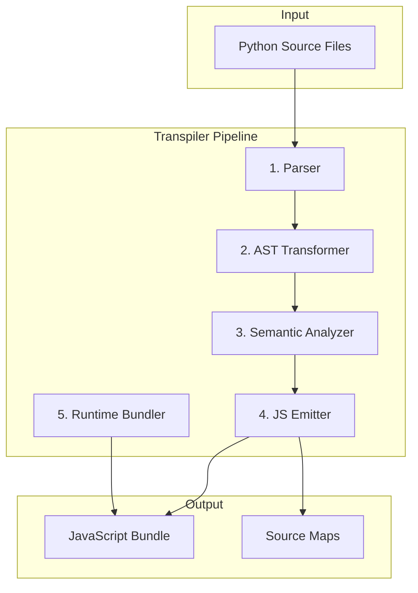

# Python-to-JavaScript Transpiler

## Architecture Overview




## Core Components

### 1. Enhanced Parser ([pynext/transpiler/parser.py](pynext/transpiler/parser.py))

Extends Python's `ast` module to create a normalized PyNext AST:

```python
@dataclass
class PyNextAST:
    functions: list[FunctionDef]
    classes: list[ClassDef]
    imports: list[ImportDef]
    top_level: list[Statement]
    reactive_primitives: list[ReactiveDef]  # signals, effects, memos
```

**Handles:**

- Module-level parsing (not just single functions)
- Import resolution and dependency tracking
- Decorator extraction (@island, @effect, @server_action)
- Reactive primitive detection

### 2. AST Transformer ([pynext/transpiler/transformer.py](pynext/transpiler/transformer.py))

Normalizes Python-specific constructs into JS-compatible forms:| Python Construct | Transformation ||-----------------|----------------|| `[x*2 for x in items]` | `items.map(x => x*2)` || `{k: v for k,v in items}` | `Object.fromEntries(items.map(([k,v]) => [k,v])) `|| `*args, **kwargs` | Rest/spread operators || `a if b else c` | `b ? a : c` || `try/except/finally` | `try/catch/finally` with error type matching || `async def / await` | Direct mapping (ES2017+) || `class Foo(Bar):` | `class Foo extends Bar` || `@decorator` | Wrapper function application |

### 3. Semantic Analyzer ([pynext/transpiler/analyzer.py](pynext/transpiler/analyzer.py))

Performs static analysis for correctness and optimization:

- **Scope Analysis**: Track variable bindings across closures
- **Type Inference**: Infer types for optimization (optional typing)
- **Reactive Analysis**: Identify signal dependencies for fine-grained updates
- **Dead Code Detection**: For tree-shaking
- **Error Detection**: Unsupported Python features

### 4. JavaScript Emitter ([pynext/transpiler/emitter.py](pynext/transpiler/emitter.py))

Generates clean, readable JavaScript:

```python
# Input
def handle_submit(form):
    if form.validate():
        items.set([*items(), form.values])
        form.reset()
        show_modal.set(False)

# Output
function handle_submit(form) {
    if (form.validate()) {
        items.set([...items(), form.values]);
        form.reset();
        show_modal.set(false);
    }
}
```


### 5. Python Runtime ([pynext/transpiler/runtime/](pynext/transpiler/runtime/))

JavaScript library providing Python semantics:

- `pynext_runtime.js` - Core runtime (~5KB gzipped)
- `pynext_builtins.js` - Python builtins (len, range, enumerate, zip, etc.)
- `pynext_types.js` - Python-like list, dict, set with methods
- `pynext_exceptions.js` - Python exception hierarchy

## Implementation Phases

### Phase 1: Core Statements (Week 1)

- Variables, assignments, augmented assignments
- if/elif/else, for/while, break/continue
- Function definitions and calls
- Lambda expressions
- Return statements

### Phase 2: Data Structures (Week 2)

- List/dict/set literals and operations
- List comprehensions
- Dict comprehensions
- Set comprehensions
- Generator expressions (as arrays)

### Phase 3: Classes (Week 3)

- Class definitions
- `__init__` to constructor
- Instance methods and properties
- Inheritance (single)
- `super()` calls

### Phase 4: Error Handling (Week 4)

- try/except/finally
- Exception type matching
- raise statements
- Custom exception classes

### Phase 5: Advanced Features (Week 5)

- async/await
- Decorators
- *args/**kwargs
- Unpacking operators

### Phase 6: PyNext Integration (Week 6)

- Signal/Effect/Memo transpilation
- DOM element creation
- Event handler optimization
- Hydration code generation

## File Structure

```javascript
pynext/transpiler/
    __init__.py          # Public API: transpile(), transpile_file()
    parser.py            # Python AST -> PyNextAST
    transformer.py       # Normalize Python constructs
    analyzer.py          # Semantic analysis
    emitter.py           # PyNextAST -> JavaScript
    runtime/
        index.js         # Runtime entry point
        builtins.js      # Python builtins
        types.js         # list, dict, set implementations
        exceptions.js    # Exception classes
    errors.py            # Transpilation errors
    sourcemap.py         # Source map generation
```


## Key Decisions

1. **Target ES2020+**: Modern browsers only, enables async/await, classes, etc.
2. **Readable Output**: Generated JS should be human-readable for debugging
3. **Minimal Runtime**: Only bundle used features (tree-shake runtime)
4. **Source Maps**: Full source map support for debugging in Python terms
5. **Gradual Adoption**: Works alongside existing @island compiler

## Testing Strategy

- Unit tests for each AST node type
- Integration tests with full Python files
- Conformance tests against Python behavior
- Performance benchmarks vs Transcrypt/Brython

## Success Metrics

- 100% of Linear app handlers transpilable
- Generated JS within 2x size of hand-written equivalent